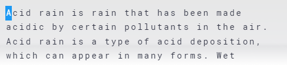

# nitrotype-bot

## How to run
First, open a terminal in the folder where you installed this app.

Next, run `locate_box.exe` in the terminal while in a nitrotype race.
Make sure that the white text area is visible and that you have not typed a full line before running.
Once locate_box.exe has finished, setup is complete.

Now, make sure nitrotype is open. In the terminal, run `main.exe (MIN WPM) (NUMBER OF RACES)` and watch the bot type.

### Example:

Your screen should have the text box something like this:

Then, run `locate_box.exe` in the terminal

After it has finished, run
`main.exe 100 3`
in the terminal.